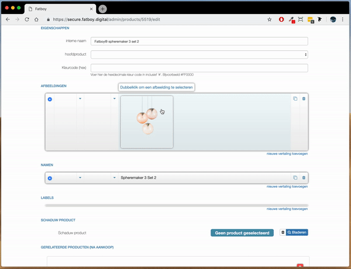

# Adviesrapport

## Inleiding

## Hoe ik het voor me zie \(nog niet alles kan onderbouwd worden\)

* Alles in Google Material style.
* shortcuts zoals in Google Drive \(CMD + A, CMD + Z\)
* Kopieren vanuit excel in meerdere invoervelden werkt altijd. 
  * \(feedback wanneer hoeveelheid niet overeenkomt.\)
  * Eerst invoervelden selecteren waar in geplakt moet worden
* selection methodes zoals in Google Drive
* Bulk bewerken \(met optie van invoeren variabelen\)
  * hoofdproducten
  * producten
  * pagina's
  * pagina componenten
* Presets
  * vooral bij hoofdproducten
* Volgorde van workflow anders. Hoofdproduct aanmaken en daarvandaan producten koppelen. 
* Elke lijst is sorteerbaar op attributen en bevat livesearch. 
* Folding UI vervangen door tab-structuur

Easy fixes:

* autofocus op eerste \(niet ingevoerde\) invoerveld
* feedback
  * kaders indicatie voor wat actief is
  * popups zoals in Google Drive 
    * optie voor ongedaan maken
    * aangeven wat zojuist aangepast is \(ook na ongedaan maken\)

## Nieuwe workflow

### Tab-structuur

Bij het aanmaken/ bewerken van een product, hoofdproduct en pagina is het een goed idee om gebruikt te maken van een tab-menu zoals in figuur1. Dankzij het tab-menu zijn alle invoervelden makkelijker te vinden en aan te klikken omdat ze altijd op relatief de dezelfde plek in het venster staan.

Figuur1

### Koppel en bewerk producten vanuit hoofdproduct

### Bewerk meerdere tegelijk

De optie om meerdere items zoals hoofdproducten, producten, features etc. te bewerken gaat enorm veel handelingen schelen. Natuurlijk komt het vaak voor dat niet elk van de geselecteerde items precies dezelfde bewerking moet ondergaan. Daar biedt de volgende interface een oplossing voor.

## Media selecteren

Het komt regelmatig voor dat meerdere producten allemaal voorzien moeten worden van een nieuw onderdeel zoals een afbeelding, maar niet altijd dezelfde. Indesign heeft hier al lang een oplossing voor bedacht.











Het venster voor het selecteren van media kan ook heel anders. 

Onthouden waar gebruiker voor het laatst media vandaan heeft en hier weer beginnen. Voor het selecteren van een icoon automatisch naar de map icons gaan. 

## Presets

Omdat er zoveel handelingen in de backend meerdere keren per product uitgevoerd moeten worden is het een goed idee om gebruik te maken van presets. Vooraf ingestelde waardes zoals features, vertalingen, iconen met bijbehorende labels etc.

Figuur3

