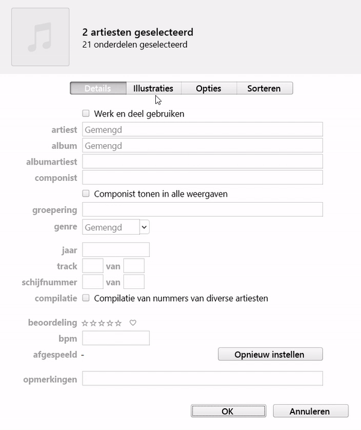

# Bulk bewerken \(70%\)

## Aanleiding

De functie die e-commerce het meeste tijd gaat besparen is de mogelijkheid om meerdere producten, hoofdproducten, pagina’s, pagina-elementen etc. tegelijkertijd te bewerken. Er is onderzocht op welke manier dit het best kan en in hoeverre dit te realiseren is op een webpagina. 

## Vooronderzoek

Om te kunnen onderbouwen waarom dit idee zinvol zou zijn is er onderzoek gedaan naar de toepasbaarheid van een bulk-bewerk functie in de huidige interface. 



Vervolgens is er gezocht naar bestaande voorbeelden van interfaces met de mogelijkheid om meerdere objecten tegelijkertijd te bewerken. 



Het meest interessante voorbeeld uit dit onderzoek was die van iTunes \(hieronder weergegeven\). Vervolgens is er gekeken in hoeverre dit te realiseren is op een webpagina. 



## Ontwerpfase

Het plan was om het prototype vanaf het begin direct zo te bouwen zodat het dynamisch inzetbaar zou zijn. Dit betekende dat het lijsten met verschillende objecten aan moest kunnen.

Het script laadt een jsonfile in en toont alle objecten vervolgens als selecteerbare list-items op de pagina. Hiervoor is het prototype [selectionmethods](../prototypes/3.-selection-methods.md) gebruikt. Wanneer er op bewerken geklikt wordt, verschijnt er een venster met de invoervelden die bij de geselecteerde objecten horen. Wanneer de invoervelden bewerkt zijn en er op opslaan geklikt wordt moeten de geselecteerde objecten uit de jsonfile geüpdatet. Daarna moet de lijst opnieuw geladen omdat het anders lijkt alsof er niets gebeurd is.

### User feedback

Het is niet altijd duidelijk of de producten veranderd zijn na dat er op 'save' geklikt is. Hier mist een vorm van feedback.

Het is ook belangrijk dat de gebruiker kan zien welke eigenschappen veranderd zullen worden tijdens het opslaan. 

De knop\(pen\) met acties voor bulkbewerking zouden pas zichtbaar moeten worden wanneer er iets geselecteerd is. 

### Voorkomen en/of herstellen van fouten

Het kan gebeuren dat de gebruiker een eigenschap aan past die voor alle geselecteerde objecten uniek moet blijven. En om dit per object op te lossen kan erg veel tijd kosten. 

Een oplossing hiervoor is dat er voor het opslaan een bevestiging gevraagd word zoals: "weet u zeker dat u voor object1, object2, object3 en 7 anderen de eigenschap\(en\) beschrijving, titel en label wilt veranderen?"

Een andere oplossing is de mogelijkheid om een bulk-bewerk-actie ongedaan te maken. Een herkenbaar voorbeeld hiervan is hoe Google Drive het aanpakt. 

### Problemen met shortcuts en prevent\_default

Er moet een systeem gebouwd worden die bijhoud welk onderdeel van de pagina 'actief' is. Dit is nodig om te bepalen wat er moet gebeuren wanneer de gebruiker een sneltoets gebruikt. Tijdens het typen in een invoerveld betekent bv. CMD + A iets anders dan wanneer de gebruiker in een selecteerbare lijst bezig is. Ook kan het voorkomen dat er meerdere selecteerbare lijsten in één pagina staan. 

Door laatst aangeklikte section bepalen wat actief is en dit door een gekleurd randje aanduiden. Indien niets aangeklikt is blijft alles grijs. Voor gebruikersgemak altijd popupvensters of de enige section automatisch actief maken. 

## Resultaten

Ik leerde dat er rekening gehouden moet worden met eigenschappen van objecten die onveranderd moeten blijven. 

Ik bedacht me dat er veel scenario’s kunnen zijn waar voor meerdere objecten een eigenschap op BIJNA dezelfde manier ingevuld kan worden. Bijvoorbeeld een zin met één variabel woord erin. 

## Vervolg onderzoek

### Links

Prototypes/bulkbewerken/ Variabelen\_invoeren.pdf

## Downloads

