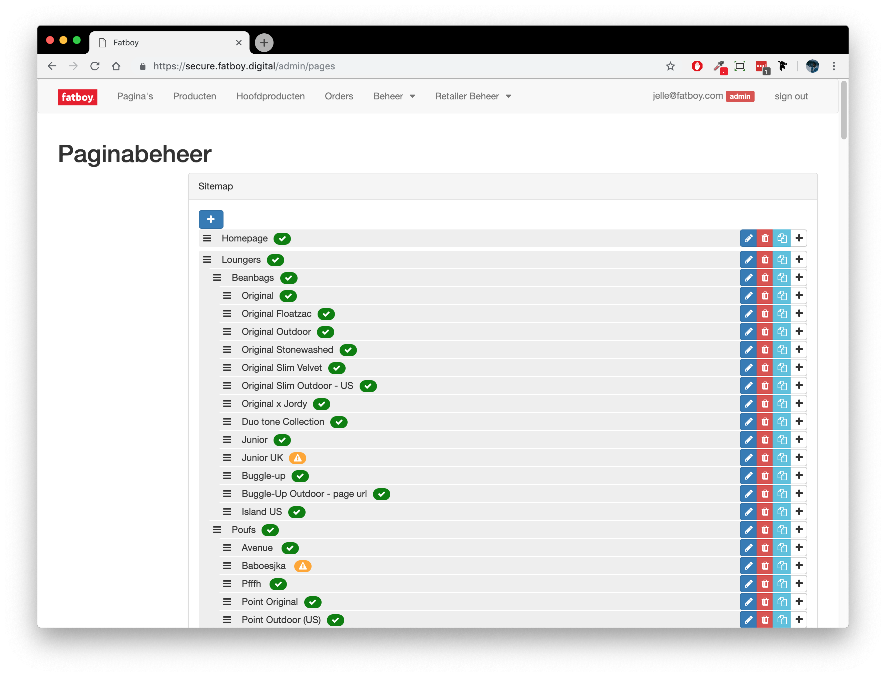
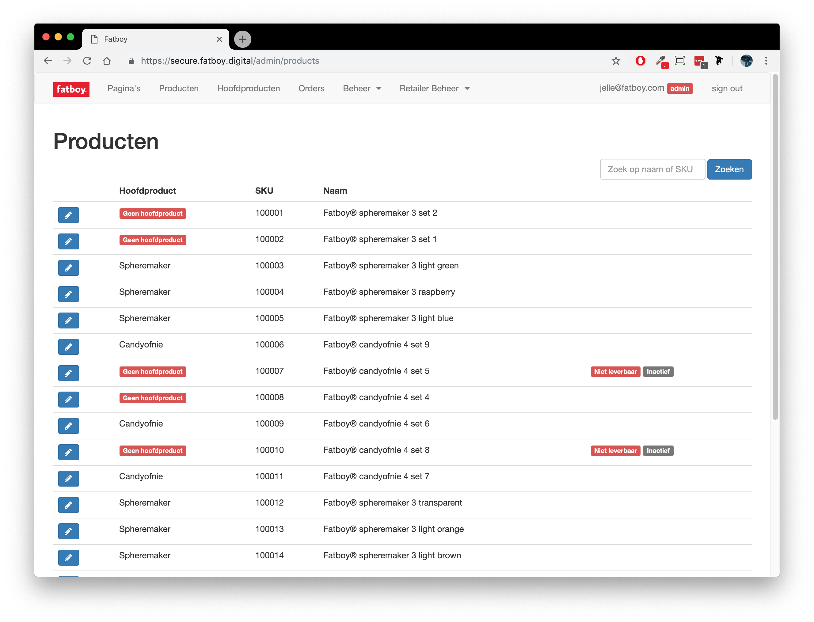
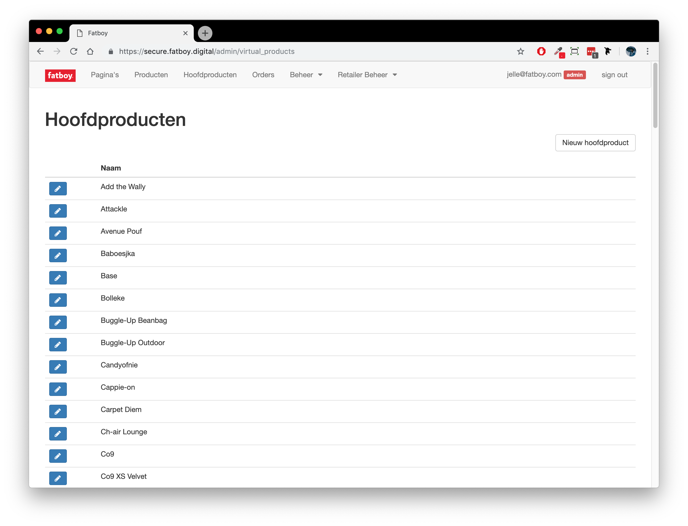

# Huidige situatie

De drie pagina's van de backend die de e-commerce afdeling gebruikt zijn de volgende drie:




Op deze pagina staan alle pagina's in de webshop. Hiervandaan kunnen pagina's aangemaakt, bewerkt verwijderd worden. 




Deze pagina toont alle producten. Deze producten worden geïmporteerd vanuit SAP. Ze kunnen hier dus niet aangemaakt of verwijderd worden. Alleen bewerken is mogelijk. 




Deze pagina toont alle 'hoofdproducten'. Een 'product' is een variant van een hoofdproduct, zoals een rode lamzac. Dit product wordt, net als de gele, blauwe en zwarte lamzac, gekoppeld aan het hoofdproduct: 'lamzac'. 



### Productlancering

Voor een productlancering krijgt de e-commerce afdeling veel content, zoals afbeeldingen, namen beschrijvingen, marketing-teksten en vertalingen, aangeleverd. Het is dan hun taak om deze content in de backend in te voeren zodat het op de webshop verschijnt. Dat gaat als volgt. 

stap 1. Hoofdproduct aanmaken en voorzien van content

stap 2. Gemiddeld 13 producten voorzien van content en koppelen aan hoofdproduct

stap 3. Pagina aanmaken, voorzien van content en producten erop zetten. 

Een  productlancering kost gemiddeld meer dan 1719 kliks. 

