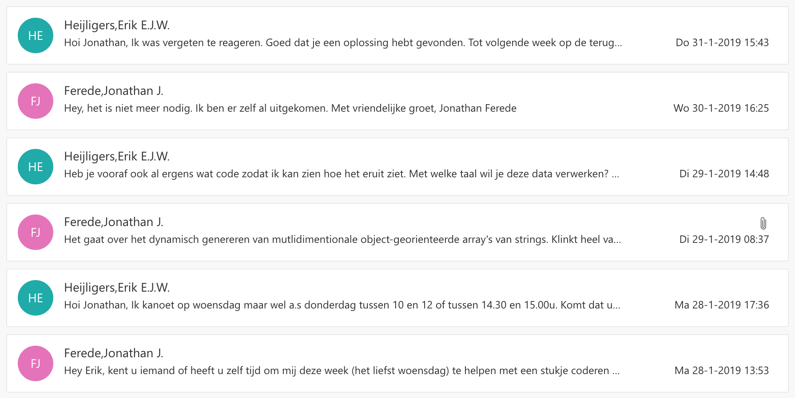

# Reflectie

## Verloop van dit project

Dit project is niet geheel volgens de oorspronkelijke planning verlopen. Maar door het werken in sprints was er de mogelijkheid om te sturen. In het begin is er gezocht naar een juiste probleemstelling. Maar na het eerste bedrijfsbezoek was de richting van dit project een stuk helderder. 

Na de terugkomdag in week 10 moesten veel oplossingen nog voorzien worden van een betere onderbouwing. Gelukkig was alle data er al om de benodigde conclusies te kunnen trekken.  

## Over mij

## Bewijs

### Kennis en inzicht

> Kennis en inzicht met juiste breedte en diepte van de ICT life cycle fases: beheer, analyse, advies, ontwerp en realisatie

In het [P.I.D.](https://github.com/JonathanFerede/afstuderen/blob/master/.gitbook/assets/p.i.d._v6.pdf) wordt breedte en diepte van dit project beschreven. 

In de volgende documenten wordt geanalyseerd.   
- Bewijs van dubbel werk.pdf  
- Hoe is de relatie tussen Fatboy en Kabisa.pdf

In het [adviesrapport](../adviesrapport/) wordt advies gegeven

> Mate van complexiteit van de opdracht en zelfstandigheid en eigen inbreng die de opdracht vergt.

Binnen Fatboy kon niemand mij helpen met programmeren in Javascript. Er zijn twee momenten geweest dat ik vast liep en ik hulp aan school heb gevraagd. Maar voor het zover was had ik het probleem zelf al opgelost. 

Ik heb een paar keer een gesprek aangevraagd met mijn schoolbegeleider omdat ik het overzicht van het project dreigde kwijt te raken. Maar vaak tijdens het voorbereiden op het gesprek, werd me alles ineens weer duidelijk. De volgende keer als ik het overzicht kwijt dreig te raken, zal ik zo'n gesprek met mijzelf inplannen. Door de voortgang van mijn project presenteerbaar te maken voor een ander wordt het voor mijzelf ook duidelijk.

Ik heb zelf de balans tussen deze afstudeeropdracht en andere klusjes gemanaged. Buiten deze afstudeeropdracht heb ik veel initiatief en verantwoordelijkheid genomen met werkzaamheden waar ik graag meer ervaring in op wilde doen. Zo ben ik o.a. director, DP, cameraman, dronepiloot en editor geweest verschillende \(reclame\)video's. \(mag ik helaas nog niets van laten zien\) 

### Beheer

> Werkwijze en tooling ingericht om tot professionele uitvoering te komen, passend bij opdracht

De werkwijze en tooling staan beschreven in het ~~P.I.D.~~

Verder heb ik de [prototypes](../prototypes/) zo gecodeerd dat ze dynamisch inzetbaar zijn en naast elkaar functioneren. 

Tot slot heb ik buiten dit project om ook verstandige keuzes gemaakt in tooling en werkwijze. Dit is terug te zien in mijn workflow \(van script tot exporteren\), filemanagement, distributie, versiebeheer met video's. 

> Gewerkt volgens ingerichte werkwijze en tooling

Gebruik gemaakt van 5-onderzoeksstrategiën model. Dit is terug te zien in het ~~P.I.D.~~

### Analyse

> Duidelijke definitie en afbakening van context, probleem of uitdaging

Link naar P.I.D.

> Probleemanalyse met juiste breedte en diepte

Link naar P.I.D.

### Advies

> Juiste afweging van belangen, mogelijkheden, kosten en baten

In het [adviesrapport](../adviesrapport/) worden mogelijkheden, kosten en baten besproken.

> Vorm en inhoud passend bij opdracht en context

Het adviesrapport met de bijbehorende prototypes zijn uiteindelijk opgeleverd. Dit sluit aan op wat er in het P.I.D. staat. Hierin wordt de context geschetst en m.b.v. de Moscow-methode de eisen opdracht beschreven.

### Ontwerp

> Aansluitend bij advies en voldoende uitgewerkt voor realisatie

LInks naar definitieve UI schetsen

LInks naar POC prototypes

In het [adviesrapport](../adviesrapport/) worden ook ontwerpkeuzes behandeld. 

### Realisatie

> Aansluitend bij ontwerp

In de documentatie die met de POC's word meegeleverd staat omschreven hoe de implementatie werkt. 

> In omvang en kwaliteit passend bij de probleemdefinitie en context

In het ~~P.I.D.~~ staan de eisen aan deze opdracht beschreven. In het adviesrapport worden alle veranderingen beschreven en onderbouwd.

### Oordeelsvorming

> Stelt vanuit een ongestructureerd praktijkprobleem juiste onderzoeksvragen en deelvragen op, in alle fasen van methodisch werken

In het ~~P.I.D.~~ is de probleemanalyse met de daarbij hordende onderzoeksvragen en methoden terug te lezen.

> Selecteert zelfstandig onderzoeksmethoden, voert deze uit en verantwoordt dit met verwijzing naar de onderzoeksstrategieën

In het P.I.D. staat beschreven welke onderzoeksvragen en daarbijhorende onderzoeksmethoden gebruikt zijn. 

> Betrekt sociaal maatschappelijke, internationale, wetenschappelijke en ethische aspecten bij oordeelsvorming

Ik heb niet klakkeloos dingen aangenomen uit interviews... \(waar is dat terug te zien???\)

Mijn oplossing is niet alleen geschikt voor Rick... \(waar is dat terug te zien???\)

Advies over situatie Fatboy tussen Kabisa??? \(Na interview met Tom e-commerce realiseerde ik me dat de situatie met Kabisa eigenlijk wel handig was.\)

### Communicatie

> Verantwoordt en verdedigt de uitvoering van een omvangrijke professionele opdracht uitgevoerd in een bedrijf of instelling zowel mondeling als schriftelijk en past daarbij de schrijfstijl aan de beoogde doelgroep aan in de Nederlandse of Engelse taal

De verantwoording van mijn werk is onder andere dit portfolio en mijn aanstaande verdediging. 

> Werkt bij de zelfstandige uitvoering van een professionele opdracht doelmatig samen

Er was geen sprake van echte samenwerking gedurende deze opdracht. Alle onderzoeken en creaties zijn zelfstandig geregeld en gemaakt. De beide begeleiders zijn wel elke sprint minimaal één keer betrokken bij de voortgang en planning. En de feedback die hieruit voortkwam is telkens gebruikt in de volgende sprint. 

### Leervermogen

> Beschrijft zijn professionele talenten en ontwikkelingsambities in relatie tot het ICT beroep

Zelfstandigheid is een van mijn talenten. Dit is terug te zien in hoe ik alle problemen tijdens programmeren  zonder hulp opgelost heb. 

Mijn technisch inzicht is terug te zien in hoe ik het mijzelf makkelijk heb gemaakt door alle [prototypes](../prototypes/) zo te maken dat ze naast elkaar kunnen functioneren. Consistentie in bestandsstructuur, opbouw van scripts, benamingen van variabelen en commentaar in de code zorgden voor overzicht en gemak bij implementatie.

> Betrekt zelfreflectie en ontvangen feedback op het eigen functioneren in het ICT beroep.

Voor mijn zelfreflectie en ontvangen feedback verwijs ik naar: [Verloop project](https://jonathanferede.gitbook.io/afstudeerportfolio/leeswijzer/reflectie#verloop-van-dit-project)

> Neemt initiatieven, stelt zich onafhankelijk op en werkt zelfstandig en resultaatgericht aan een professionele opdracht buiten school

Vooral tijdens de ontwerpfase heb ik veel initiatief getoond door veel prototypes te bouwen en te presenteren. Ook naast deze opdracht heb ik veel initiatief getoond door te helpen met verschillende mediaprojecten.

