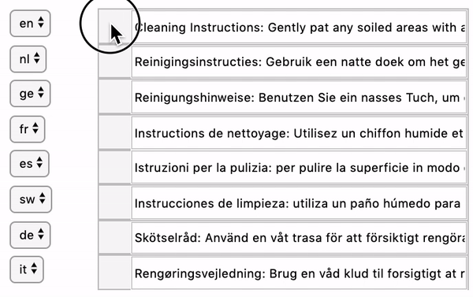
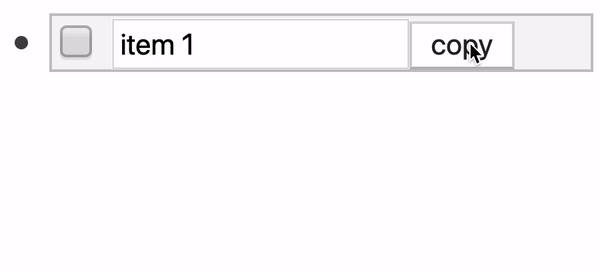

# Sortable form 95% \(geen goede aanleiding, dus misschien maar weglaten\)

## Aanleiding

Er is onderzocht of het mogelijk was een HTML-formulier te maken waarbij de gebruiker de volgorde kan veranderen. In de huidige backend kun je de volgorde van de lijst van pagina's veranderen door te slepen. En dit bracht me op een idee. Hoe handig zou het zijn als je invoervelden \(per vertaling\) van volgorde kon veranderen.

## Aanpak

Ik heb gezocht naar bestaande libraries die een formulier sorteerbaar maakte. Één van deze heb ik gedownload en  geprobeerd naar mijn wensen om te bouwen. 

## Resultaat

## Download



