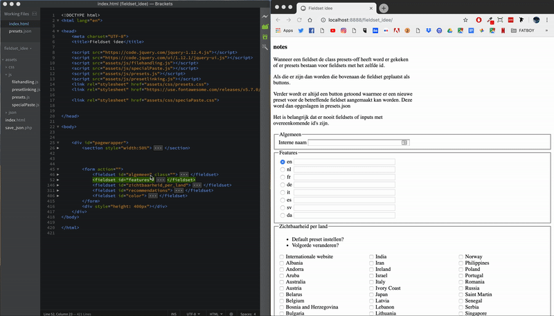

# Presets

## Aanleiding

Verwijzen naar bewijs van dubbel werk. 

## Aanpak

Het plan was vanaf het begin al om een dynamisch systeem te maken. Eenvoudig implementeerbaar. 

## Resultaat

### Eenvoudig implementeren

Alleen script inladen en classes toevoegen aan fieldsets. 

```text
<fieldset id="features" class="presets-on"> ...
```



### Special Paste

De verbetering van Paste from excel

### Opmerkingen

#### Caching

Na het updaten van een preset of het aanmaken van een nieuwe word deze niet altijd getoond. Dit komt door het automatisch cachen van de pagina. Ik heb het volgende geprobeerd. Maar helaas werkt dit niet altijd. 

```text
function reload() {
    if (confirm("are you sure you want to reload?"))
        location.reload(true);
}
```


Dit systeem gaat er vanuit dat er met fieldsets gewerkt word en deze unieke ID's hebben. 

#### Clear button

Behoefte aan clear-input knopje of standaard 'empty'-preset.




