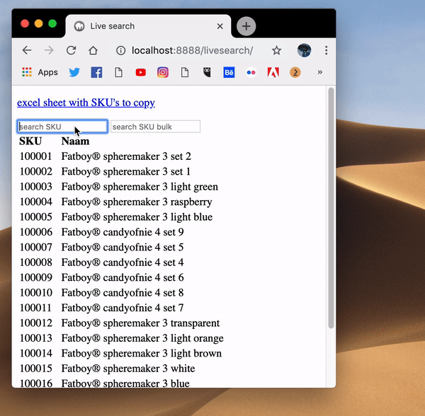

# Livesearch 95%

## Aanleiding

Livesearch voor lange lijsten miste ik heel erg in de huidige backend. Ik wilde weten wat ervoor nodig was om het zelf te bouwen.

## Aanpak

Online zoeken naar bestaande voorbeelden. Deze voorbeelden downloaden, proberen te begrijpen en vervolgens zelf na te bouwen/ aan te passen naar mijn eisen.

## Resultaat 

Ik heb het script van [Paste csv](6.-paste-csv.md) hierin gebruikt voor het eenvoudig kopieren en plakken van SKU's vanuit Excel. 

Terwijl ik het aan het bouwen was bedacht ik dat het handig zou kunnen zijn om een lijst van SKU-nummers in een zoekveld in te voeren. Rick heeft namelijk een keer een lijst met SKU’s binnen gekregen waar iets aan veranderd moest worden. En in het huidige systeem moet elke SKU individueel opgezocht worden. Het normale livesearch en 'bulk-livesearch' is beide gelukt. Het wordt ingewikkelder als er meerdere lijsten met livesearch op de pagina staan. Maar zeker niet onmogelijk.

## Downloads



