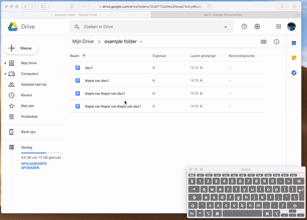

# Selectie methodes 75%

## Aanleiding

Er is onderzocht in hoeverre het mogelijk is om de selectiemethodes zoals die in de de webversie van Google Drive na te bouwen. 

## Aanpak

Er is gebruik gemaakt van de jQuery UI Selectable plugin \([http://api.jqueryui.com/selectable/](http://api.jqueryui.com/selectable/)\). Omdat deze direct bij jQuery vandaan komt en voorzien was van voldoende documentatie. 

## Resultaat

### Opmerkingen

Het tekenen van selectiekaders werkte niet goed samen met de feature om de sorteren. 

## Downloads



