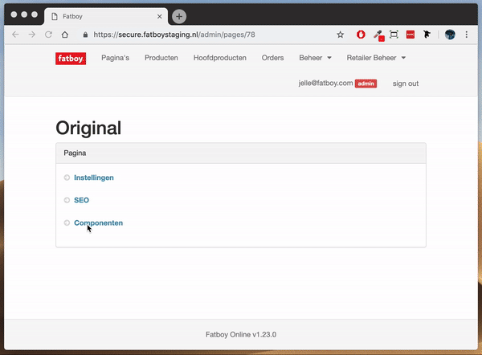
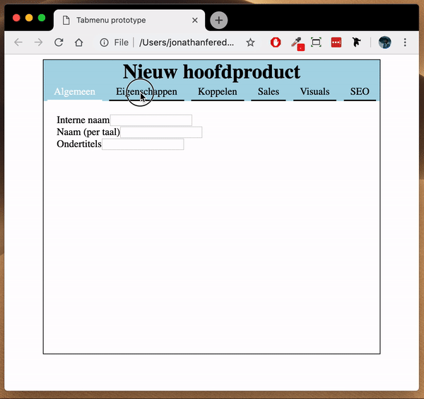

# Tab-structuur 80%

_Feedback: "Je geeft hier aan dat de oplossing is om ipv alles onder elkaar te zetten en eindeloos te moeten scrollen, dat een tabstructuur ervoor zorgt dat dat niet meer hoeft en dat knoppen voortaan op dezelfde plek op het scherm verschijnen. Maar waarom vinden gebruikers het zo belangrijk of fijn dat die knoppen altijd op dezelfde plek staan? Je kan waarschijnlijk niet alles onderbouwen, maar een heleboel van de verbeteringen die je toepast zijn allemaal terug te verwijzen naar hele "menselijke principes”._

Zoals in het voorbeeld hieronder te zien is, word de huidige 'folding UI' vrij lastig te navigeren wanneer er veel onderdelen open staan. De oplossing hiervoor is een tab-structuur. De tab-structuur verminderd niet het aantal kliks, maar wel hoeveel de gebruiker moet scrollen. Daarnaast is het bij een tabstructuur, in tegenstelling tot de 'folding UI', zo dat alle knoppen altijd op dezelfde plek in het scherm verschijnen. Dit betekent minder zoeken en sneller werken. 











## Gebruikerstest

De volgorde, namen en content van de tabjes zijn niet gelijk gebleven aan die van huidige interface omdat  dit logischer leek. De gebruikerstest wees uit dat het ondanks de veranderingen toch intuïtief was. 

## Downloads



